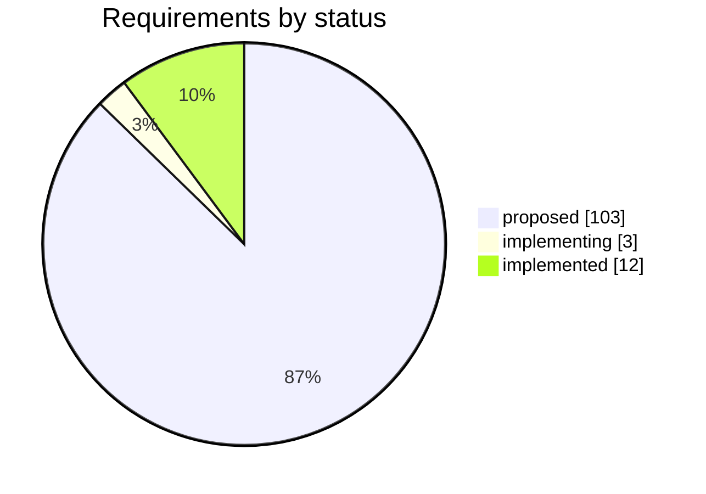
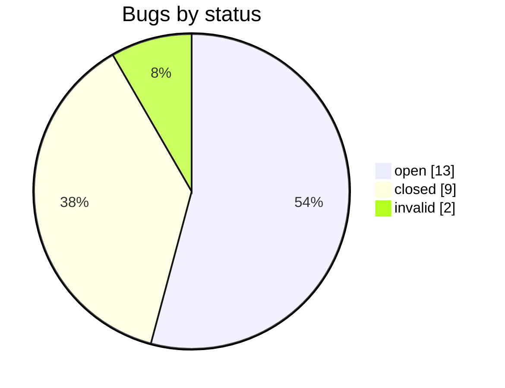

# Project Status

_Generated 2026-05-29 06:33 · regenerate with `python scripts/stats.py > STATUS.md`_

## Requirements

**Total:** 118

### By priority

| Priority | Count |
| --- | --- |
| Must | 104 |
| Should | 12 |
| — | 2 |

### By status

| Status | Count |
| --- | --- |
| proposed | 103 |
| implementing | 3 |
| implemented | 12 |

### By section

| Section | Total | Verified | Not done |
| --- | --- | --- | --- |
| CMP | 6 | 0 | 6 |
| DET | 12 | 0 | 11 |
| DOC | 4 | 0 | 4 |
| DSK | 10 | 0 | 8 |
| FUN | 7 | 0 | 6 |
| FWK | 27 | 0 | 27 |
| LOG | 22 | 0 | 22 |
| NET | 13 | 0 | 13 |
| PWR | 7 | 0 | 0 |
| SET | 5 | 0 | 4 |
| SLP | 5 | 0 | 5 |

### Must-priority requirements not yet implemented

| ID | Status | Title |
| --- | --- | --- |
| [CMP001](requirements/CMP001.md) | proposed | Primary Supported OS Declaration |
| [CMP003](requirements/CMP003.md) | proposed | Distribution-Aware Package Installation |
| [CMP004](requirements/CMP004.md) | proposed | Required Tool Declaration and Auto-Install |
| [CMP005](requirements/CMP005.md) | proposed | Graceful Handling of Unavailable Tools |
| [CMP006](requirements/CMP006.md) | proposed | Bug OS Column Scope Convention |
| [DET001](requirements/DET001.md) | proposed | CPU Model and Core Count |
| [DET002](requirements/DET002.md) | proposed | RAM Capacity and DIMM Population |
| [DET003](requirements/DET003.md) | proposed | Network Interface Model and Count |
| [DET004](requirements/DET004.md) | proposed | USB Device Model and Speed |
| [DET005](requirements/DET005.md) | proposed | Storage Device Model and Capacity |
| [DET006](requirements/DET006.md) | proposed | PCIe Link Speed and Width |
| [DET007](requirements/DET007.md) | proposed | Concise Summary Log |
| [DET008](requirements/DET008.md) | proposed | Full lshw Reference Log |
| [DET009](requirements/DET009.md) | proposed | Golden Reference Comparison |
| [DET010](requirements/DET010.md) | proposed | Configurable Golden Reference Path |
| [DET011](requirements/DET011.md) | proposed | Diff Output in Test Log |
| [DOC003](requirements/DOC003.md) | proposed | Bug Status Vocabulary |
| [DOC004](requirements/DOC004.md) | proposed | Test Verdict Vocabulary |
| [DSK001](requirements/DSK001.md) | proposed | Storage Device Enumeration |
| [DSK002](requirements/DSK002.md) | proposed | OS Partition Exclusion from Destructive Tests |
| [DSK003](requirements/DSK003.md) | proposed | Explicit Confirmation Before Destructive Tests |
| [DSK004](requirements/DSK004.md) | implementing | Separate fio Profiles for SATA and NVMe |
| [DSK005](requirements/DSK005.md) | proposed | PASS/FAIL Verdict per fio Pattern |
| [DSK006](requirements/DSK006.md) | proposed | Disk Test Summary Table Format |
| [DSK008](requirements/DSK008.md) | proposed | Invalid Block Device Filtering |
| [FUN001](requirements/FUN001.md) | proposed | Auto-Detect and Install iperf3 |
| [FUN002](requirements/FUN002.md) | proposed | Auto-Detect and Install fio |
| [FUN003](requirements/FUN003.md) | proposed | Total Elapsed Wall-Clock Time |
| [FUN004](requirements/FUN004.md) | proposed | Idempotent Tool Installation |
| [FUN005](requirements/FUN005.md) | proposed | Shared log() Interface |
| [FUN006](requirements/FUN006.md) | proposed | Exactly-Once Counter Semantics |
| [FWK001](requirements/FWK001.md) | proposed | Snake Case Naming |
| [FWK002](requirements/FWK002.md) | proposed | Private Variable Naming |
| [FWK003](requirements/FWK003.md) | proposed | Private Function Naming |
| [FWK004](requirements/FWK004.md) | proposed | Config and Function as Public API |
| [FWK005](requirements/FWK005.md) | proposed | Semantic Version Strings |
| [FWK006](requirements/FWK006.md) | proposed | Config API Version Declaration |
| [FWK007](requirements/FWK007.md) | proposed | Function API Version Declaration |
| [FWK008](requirements/FWK008.md) | proposed | Function–Config Version Compatibility Check |
| [FWK009](requirements/FWK009.md) | proposed | Test Script Version Verification at Startup |
| [FWK010](requirements/FWK010.md) | proposed | Config Sourced Before Function |
| [FWK011](requirements/FWK011.md) | proposed | Strict Error Handling |
| [FWK012](requirements/FWK012.md) | proposed | Session ID for Test Run Identity |
| [FWK013](requirements/FWK013.md) | proposed | Resume After Power Cycle |
| [FWK014](requirements/FWK014.md) | proposed | 4-Bit Sleep State Encoding |
| [FWK015](requirements/FWK015.md) | proposed | Loop Count Argument |
| [FWK016](requirements/FWK016.md) | proposed | Headless / Non-Interactive Execution |
| [FWK018](requirements/FWK018.md) | proposed | Detached Execution via Session Manager |
| [FWK020](requirements/FWK020.md) | proposed | DUT-Side Test Completion Detection |
| [FWK021](requirements/FWK021.md) | proposed | Flat Deployment Directory on DUT |
| [FWK022](requirements/FWK022.md) | proposed | Result Packaging and Retrieval |
| [FWK024](requirements/FWK024.md) | proposed | Non-Interactive Flags via Environment Variables |
| [FWK025](requirements/FWK025.md) | proposed | Script Self-Elevation to Root |
| [FWK026](requirements/FWK026.md) | proposed | Output File Ownership Restoration |
| [FWK027](requirements/FWK027.md) | proposed | No Silent State Mutation in Helper Functions |
| [LOG001](requirements/LOG001.md) | proposed | Logs Directory Creation |
| [LOG002](requirements/LOG002.md) | proposed | All Test Output in logs/ |
| [LOG003](requirements/LOG003.md) | proposed | Log Filename Includes Test Name |
| [LOG004](requirements/LOG004.md) | proposed | Log Filename Includes Loop Number |
| [LOG005](requirements/LOG005.md) | proposed | Log Filename Includes ISO 8601 Timestamp |
| [LOG006](requirements/LOG006.md) | proposed | Log Filename Includes Test Result |
| [LOG007](requirements/LOG007.md) | proposed | Log File Extension |
| [LOG008](requirements/LOG008.md) | proposed | Log Filename Order |
| [LOG009](requirements/LOG009.md) | proposed | Log Directory Verification at Startup |
| [LOG010](requirements/LOG010.md) | proposed | Elapsed Time Reporting |
| [LOG011](requirements/LOG011.md) | proposed | Per-fio-Invocation Log File |
| [LOG012](requirements/LOG012.md) | proposed | fio Log Filename Convention |
| [LOG013](requirements/LOG013.md) | proposed | Disk Test Average Throughput Summary |
| [LOG014](requirements/LOG014.md) | proposed | Log Entry Timestamp and Level Prefix |
| [LOG015](requirements/LOG015.md) | proposed | Machine-Readable result.json |
| [LOG017](requirements/LOG017.md) | proposed | Three-Artefact Output Model |
| [LOG018](requirements/LOG018.md) | proposed | HTML Report Generated from result.json |
| [LOG020](requirements/LOG020.md) | proposed | Minimum result.json Fields |
| [LOG021](requirements/LOG021.md) | proposed | Output File Ownership |
| [LOG022](requirements/LOG022.md) | proposed | ISO 8601 Timestamp Consistency |
| [NET001](requirements/NET001.md) | proposed | Enumerate enp and eno Interfaces |
| [NET002](requirements/NET002.md) | proposed | Namespace-Based Loopback Testing |
| [NET003](requirements/NET003.md) | proposed | Clean Namespace State Before Testing |
| [NET004](requirements/NET004.md) | proposed | Test at All Advertised Link Speeds |
| [NET005](requirements/NET005.md) | proposed | ICMP Connectivity Verification |
| [NET006](requirements/NET006.md) | proposed | iperf3 Throughput in Four Combinations |
| [NET007](requirements/NET007.md) | proposed | Configurable iperf3 Duration |
| [NET008](requirements/NET008.md) | proposed | Verdict Assignment per Test Item |
| [NET011](requirements/NET011.md) | implementing | NIC Include/Exclude Lists |
| [NET013](requirements/NET013.md) | proposed | iperf3 Log Filename Convention |
| [SET001](requirements/SET001.md) | proposed | Tunable Parameters in config Only |
| [SET002](requirements/SET002.md) | proposed | Utility Functions in function Only |
| [SET003](requirements/SET003.md) | proposed | config Contains No Executable Logic |
| [SET004](requirements/SET004.md) | proposed | Environment Variable Overrides for Config Defaults |
| [SLP001](requirements/SLP001.md) | proposed | ACPI Sleep State Detection |
| [SLP002](requirements/SLP002.md) | proposed | Configurable Pre-Sleep Delay |
| [SLP003](requirements/SLP003.md) | proposed | Configurable Wake Timer |
| [SLP004](requirements/SLP004.md) | proposed | Post-Wake Service Verification |
| [SLP005](requirements/SLP005.md) | proposed | Atomic Sleep State Bit-Field Update |

## Bugs

**Total:** 24

### By status

| Status | Count |
| --- | --- |
| open | 13 |
| closed | 9 |
| invalid | 2 |

### By OS

| OS | Count |
| --- | --- |
| Ubuntu 26.04 LTS | 14 |
| Ubuntu 24.04 LTS | 10 |

### Open bugs (oldest first)

| ID | Created | Status | Title |
| --- | --- | --- | --- |
| [BUG0003](bugs/open/BUG0003-safe-to-power-off-message-misleading.md) | 2026-04-30 | open | Safe to power off message misleading |
| [BUG0004](bugs/open/BUG0004-fio-log-filenames-missing-timestamp-and-result.md) | 2026-05-05 | open | fio log filenames missing timestamp and result |
| [BUG0005](bugs/open/BUG0005-date2-not-initialised-by-setup-session.md) | 2026-05-05 | open | _date2 not initialised by setup_session |
| [BUG0006](bugs/open/BUG0006-disk-test-sh-does-not-call-run-time-at-start.md) | 2026-05-05 | open | disk_test.sh does not call run_time at start |
| [BUG0007](bugs/open/BUG0007-wall-broadcast-progress-message-uses-1-1-eta-0s.md) | 2026-05-05 | open | wall broadcast progress message uses 1/1 ETA 0s |
| [BUG0008](bugs/open/BUG0008-ansible-fetches-entire-logs-dir-instead-of-current.md) | 2026-05-05 | open | Ansible fetches entire logs dir instead of current session only |
| [BUG0012](bugs/open/BUG0012-dev-detect-first-run-snapshot-vs-golden-template-n.md) | 2026-05-05 | open | dev_detect first-run snapshot vs golden template not visually distinguishable |
| [BUG0013](bugs/open/BUG0013-log-entries-do-not-include-log-level-prefix.md) | 2026-05-05 | open | Log entries do not include log level prefix |
| [BUG0015](bugs/open/BUG0015-net-test-sh-consumes-the-ssh-lifeline-nic.md) | 2026-05-05 | open | net_test.sh consumes the SSH lifeline NIC |
| [BUG0016](bugs/open/BUG0016-dimm8-row-formatting-differs-from-dimm1-7-in-detec.md) | 2026-05-05 | open | DIMM8 row formatting differs from DIMM1-7 in detect_ram output |
| [BUG0020](bugs/open/BUG0020-sleep-test-not-yet-integrated-or-verified.md) | 2026-05-08 | open | sleep_test not yet integrated or verified |
| [BUG0022](bugs/open/BUG0022-the-notification-is-misleading.md) | 2026-05-14 | open | The notification is misleading |
| [BUG0023](bugs/open/BUG0023-two-log-dir-echo-statements-joined-on-one-line-in-.md) | 2026-05-14 | open | Two log_dir echo statements joined on one line in function.sh |

## Traceability

### Requirements with associated bugs

| Requirement | Bug | Bug status |
| --- | --- | --- |
| CMP005 | [BUG0011](bugs/closed/BUG0011-dev-detect-aborts-silently-when-an-upstream-detect.md) | closed |
| DET009 | [BUG0012](bugs/open/BUG0012-dev-detect-first-run-snapshot-vs-golden-template-n.md) | open |
| FUN005 | [BUG0013](bugs/open/BUG0013-log-entries-do-not-include-log-level-prefix.md) | open |
| FWK025 | [BUG0014](bugs/closed/BUG0014-root-requirement-of-detection-scripts-not-formalis.md) | closed |
| FWK026 | [BUG0002](bugs/closed/BUG0002-cannot-open-dev-detect-sh-html-report.md) | closed |
| FWK026 | [BUG0014](bugs/closed/BUG0014-root-requirement-of-detection-scripts-not-formalis.md) | closed |
| FWK027 | [BUG0019](bugs/closed/BUG0019-result-json-metadata-corruption-session-id-unknown.md) | closed |
| LOG008 | [BUG0004](bugs/open/BUG0004-fio-log-filenames-missing-timestamp-and-result.md) | open |
| LOG012 | [BUG0024](bugs/closed/BUG0024-extract-bw-fails-on-slow-disks-no-data-0-0-mib-s-f.md) | closed |
| LOG012 | [BUG0004](bugs/open/BUG0004-fio-log-filenames-missing-timestamp-and-result.md) | open |
| LOG014 | [BUG0013](bugs/open/BUG0013-log-entries-do-not-include-log-level-prefix.md) | open |
| LOG015 | [BUG0001](bugs/closed/BUG0001-no-total-test-time.md) | closed |
| LOG015 | [BUG0009](bugs/closed/BUG0009-result-json-not-yet-implemented.md) | closed |
| LOG015 | [BUG0019](bugs/closed/BUG0019-result-json-metadata-corruption-session-id-unknown.md) | closed |
| LOG015 | [BUG0024](bugs/closed/BUG0024-extract-bw-fails-on-slow-disks-no-data-0-0-mib-s-f.md) | closed |
| LOG018 | [BUG0001](bugs/closed/BUG0001-no-total-test-time.md) | closed |
| LOG018 | [BUG0018](bugs/closed/BUG0018-html-report-total-test-time-computed-from-file-mti.md) | closed |
| LOG018 | [BUG0010](bugs/invalid/BUG0010-html-reports-may-be-parsing-log-instead-of-reading.md) | invalid |
| LOG020 | [BUG0019](bugs/closed/BUG0019-result-json-metadata-corruption-session-id-unknown.md) | closed |
| LOG021 | [BUG0002](bugs/closed/BUG0002-cannot-open-dev-detect-sh-html-report.md) | closed |
| LOG022 | [BUG0019](bugs/closed/BUG0019-result-json-metadata-corruption-session-id-unknown.md) | closed |
| NET011 | [BUG0015](bugs/open/BUG0015-net-test-sh-consumes-the-ssh-lifeline-nic.md) | open |
| NET012 | [BUG0015](bugs/open/BUG0015-net-test-sh-consumes-the-ssh-lifeline-nic.md) | open |
| SLP001 | [BUG0020](bugs/open/BUG0020-sleep-test-not-yet-integrated-or-verified.md) | open |
| SLP004 | [BUG0020](bugs/open/BUG0020-sleep-test-not-yet-integrated-or-verified.md) | open |
| SLP005 | [BUG0020](bugs/open/BUG0020-sleep-test-not-yet-integrated-or-verified.md) | open |

### Implemented Must-priority requirements with no associated bug

_(may indicate untested code paths — worth a review)_

| ID | Status | Title |
| --- | --- | --- |
| [DET012](requirements/DET012.md) | implemented | Windows Hardware Baseline Verification |
| [DSK009](requirements/DSK009.md) | implemented | fio Engine and Write-Consistency Flags Aligned with KDiskMark v3.2.0 |
| [FUN007](requirements/FUN007.md) | implemented | Windows PowerShell Shared Function Library |
| [PWR001](requirements/PWR001.md) | implemented | AT and ATX PSU Type Selection |
| [PWR002](requirements/PWR002.md) | implemented | GPIO Relay Abstraction |
| [PWR003](requirements/PWR003.md) | implemented | Network-Based DUT Liveness Detection |
| [PWR004](requirements/PWR004.md) | implemented | Per-Cycle Verdict Taxonomy |
| [PWR005](requirements/PWR005.md) | implemented | Structured result.json Output (LOG015 Compliance) |
| [PWR007](requirements/PWR007.md) | implemented | Safety Controls: Consecutive Fail Abort and Graceful Stop |
| [SET005](requirements/SET005.md) | implemented | Windows DUT Pre-test Bootstrap Script |

